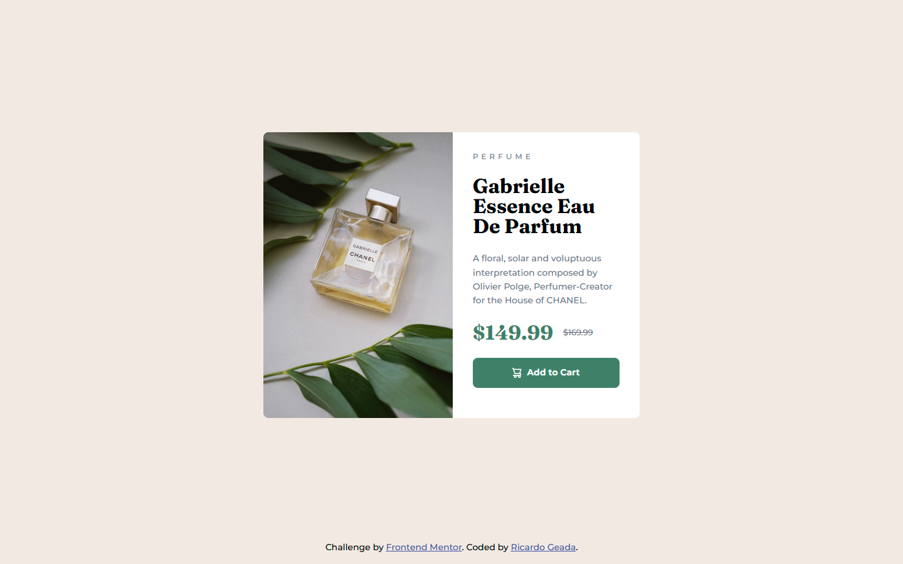

# Frontend Mentor - Product preview card component solution

This is a solution to the [Product preview card component challenge on Frontend Mentor](https://www.frontendmentor.io/challenges/product-preview-card-component-GO7UmttRfa). Frontend Mentor challenges help you improve your coding skills by building realistic projects.

## Table of contents

- [Overview](#overview)
  - [The challenge](#the-challenge)
  - [Screenshot](#screenshot)
  - [Links](#links)
- [My process](#my-process)
  - [Built with](#built-with)
  - [What I learned](#what-i-learned)
  - [Continued development](#continued-development)
- [Author](#author)

## Overview

### The challenge

Users should be able to:

- View the optimal layout depending on their device's screen size
- See hover and focus states for interactive elements

### Screenshot



### Links

- Solution URL: [github.com/RicardoGeada/fm-product-preview-card-component/](https://github.com/RicardoGeada/fm-product-preview-card-component)
- Live Site URL: [ricardogeada.github.io/fm-product-preview-card-component/](https://ricardogeada.github.io/fm-product-preview-card-component/)

## My process

### Built with

- Semantic HTML5 markup
- CSS custom properties
- Flexbox

### What I learned

I learned how to use the `<picture>` element to serve different images depending on the screen size. This allows better optimization and responsiveness by loading smaller images on mobile devices and larger ones on desktop.

```html
<picture>
  <source
    media="(max-width: 767px)"
    srcset="./images/image-product-mobile.jpg"
  />
  <source
    media="(min-width: 768px)"
    srcset="./images/image-product-desktop.jpg"
  />
  
</picture>
```

The browser picks the appropriate <source> based on the media condition. The  tag serves as a fallback and also provides the alt text for accessibility.

### Continued development

In the future, I want to explore additional techniques for building responsive designs more effectively.


## Author

- Website - [ricardogeada.com](https://www.ricardogeada.com)
- Frontend Mentor - [@RicardoGeada](https://www.frontendmentor.io/profile/RicardoGeada)


